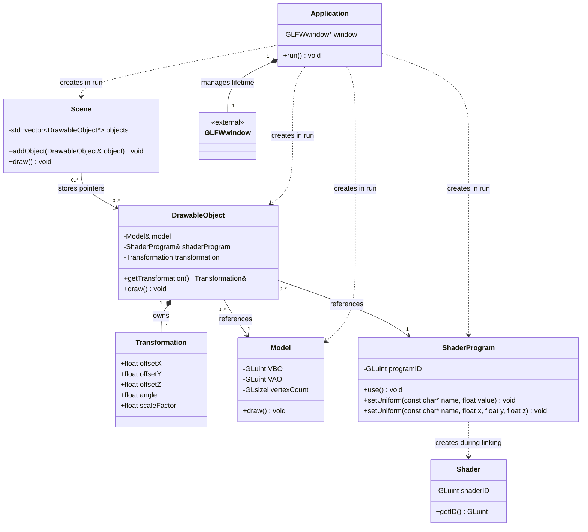

# Class diagram - Exercise 3

Project: ZPG  
Author: Martin Jarabica (jar0193)  
AI contribution: This diagram and its explanations were prepared with ChatGPT from the current source code.

The diagram shows the main fields, selected methods and relationships in the current application.

## Reading the diagram

- `+` means public and `-` means private.
- A solid arrow (`-->`) shows a stored reference or pointer without ownership.
- A filled diamond (`*--`) marks ownership; the diamond is on the owner's side.
- A dashed arrow (`..>`) shows a dependency, such as creating a temporary or local object.
- `1` means exactly one and `0..*` means zero or more.

## How this matches the code

- `Application` creates and destroys the GLFW window. Scenes, drawable objects, models and shader programs are local variables inside `run()`, not fields of `Application`.
- `Scene` stores pointers to drawable objects and calls their `draw()` methods. It does not destroy the objects. The same signature object belongs to several scenes.
- `DrawableObject` references an existing model and shader program, and owns its transformation. The twelve trees share one model but have separate transformations.
- `Model` manages the VBO and VAO and stores the vertex count used by `glDrawArrays()`.
- `ShaderProgram` manages a linked OpenGL program and sends uniform values. Its constructor creates two local `Shader` objects, links their shaders and detaches them. The local objects are then destroyed; they are not fields of `ShaderProgram`.
- `Shader` loads and compiles a vertex or fragment shader and manages its OpenGL identifier.
- `Transformation` stores translation, rotation around the Y axis and a uniform scale factor.

## Rendering order

`Application::run()` calls the active scene's `draw()`. The scene calls each object's `draw()`. Each object activates its shader program, sends its transformation through uniforms and calls its model's `draw()` to submit the triangles.
