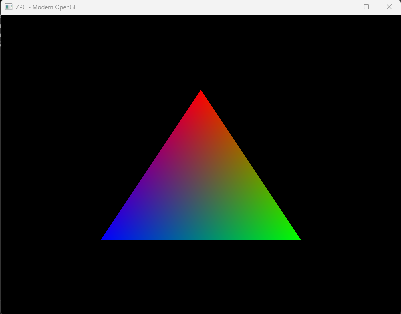
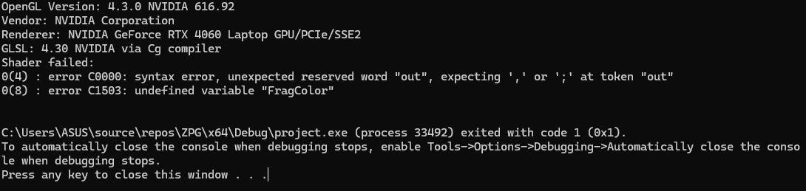
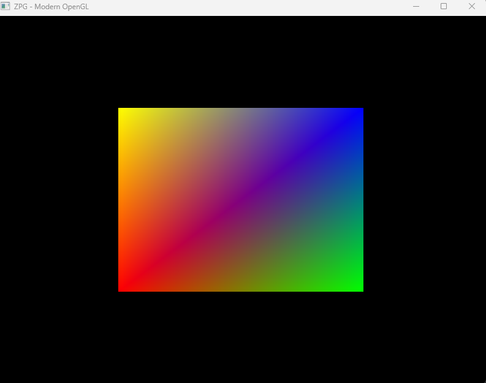
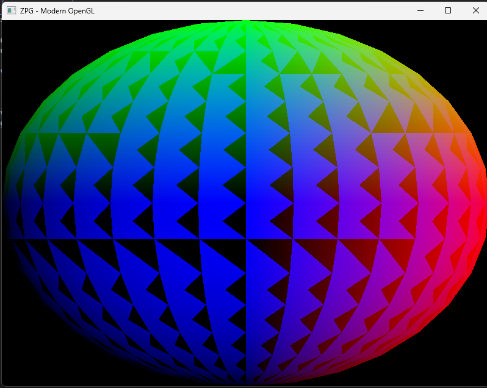
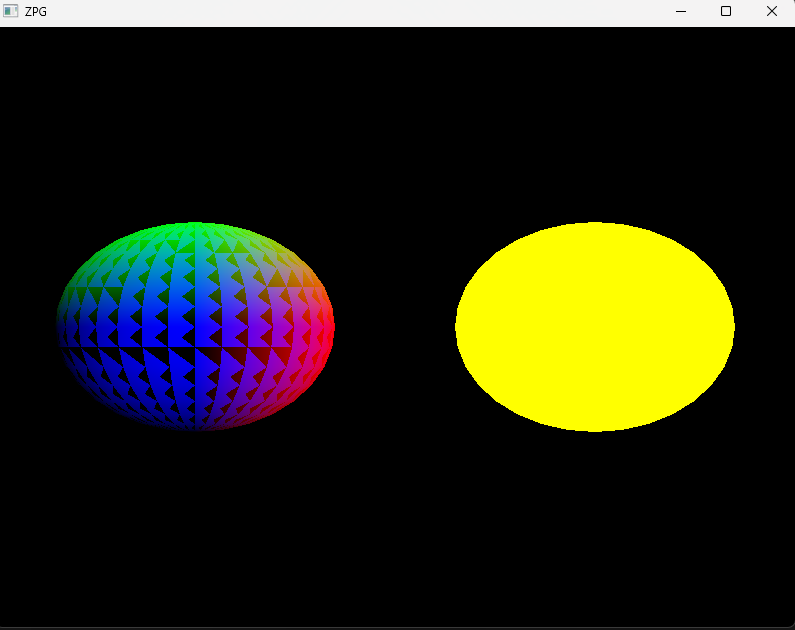
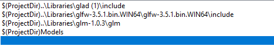

# Cvičenie 2

Screenshoty zachytávajú postup riešenia. Aktuálna verzia zobrazuje dve gule.

## 1. Programovateľná pipeline

**Splnené**

Použil som GLAD, vertex a fragment shader a pomocou VBO a VAO som vykreslil farebný trojuholník. Výsledok je na obrázku.

## 2. Chyba v shaderi

**Splnené**

V shaderi som schválne vymazal bodkočiarku a program vypísal chybu a ukončil sa, čo vidno v konzole na obrázku. Potom som bodkočiarku vrátil, aby program znova fungoval.

## 3. Štvorec so žltým vrcholom

**Splnené**

Z dvoch trojuholníkov som vytvoril štvorec a štvrtému rohu som nastavil žltú farbu `(1, 1, 0)`. Na obrázku je žltý ľavý horný roh.

## 4. Priložený model

**Splnené**

Namiesto údajov štvorca som použil údaje gule zo súboru `sphere.h`. Na obrázku je guľa s prekrývajúcimi sa trojuholníkmi, pretože som pri tejto ukážke vypol test hĺbky.

## 5. Viac objektov a shader programov

**Splnené**

Guľu som vykreslil dvakrát s rôznymi shader programami – vľavo je farebná a vpravo žltá. Vedľa seba som ich posunul pripočítaním vektorov vo vertex shaderoch.

## 6. Relatívne cesty

**Splnené**

Pri načítaní shaderov používam cesty ako `shaders/basic.vert`. Cesty ku knižniciam a modelom som nastavil cez `$(ProjectDir)`, čo vidno na obrázku.

