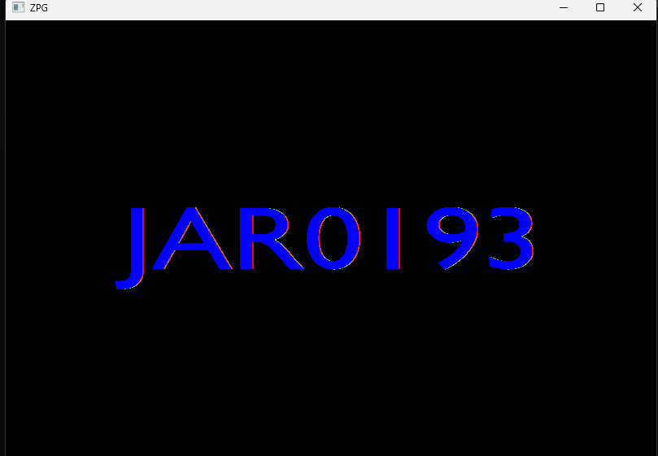
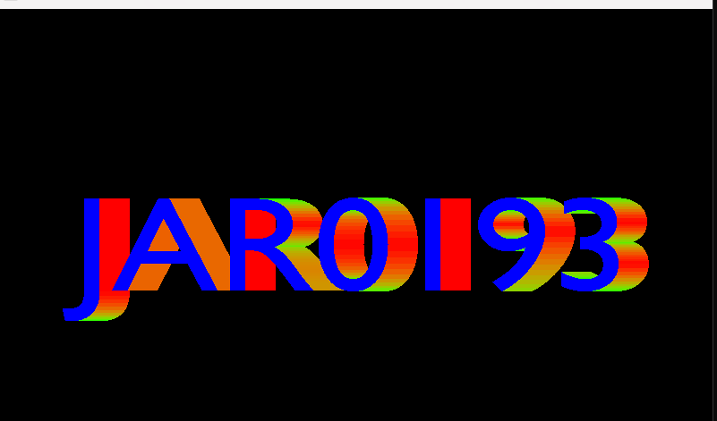
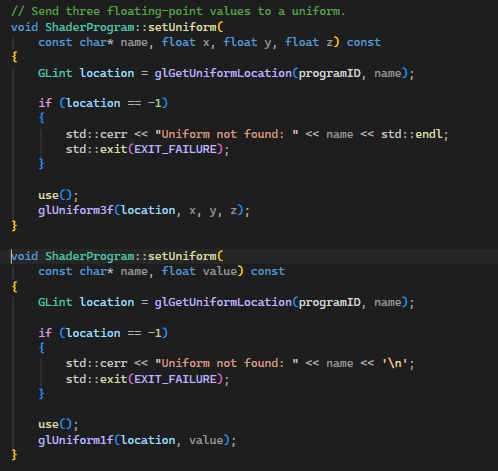
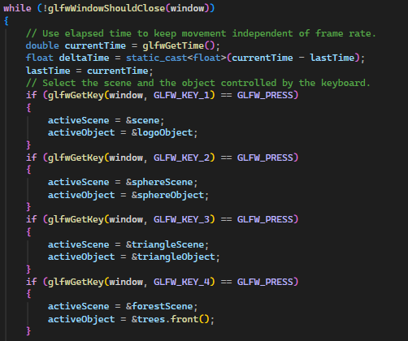
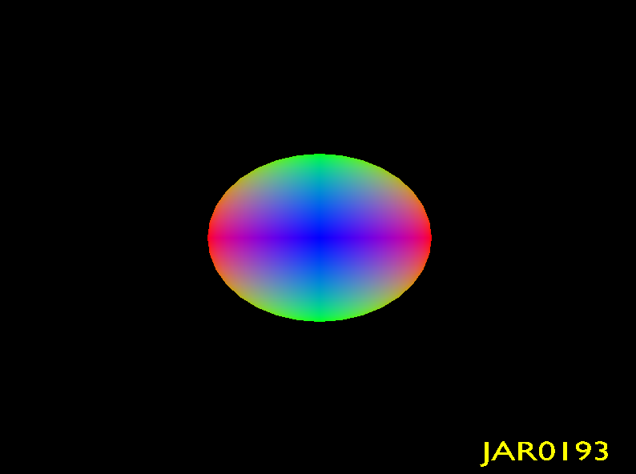
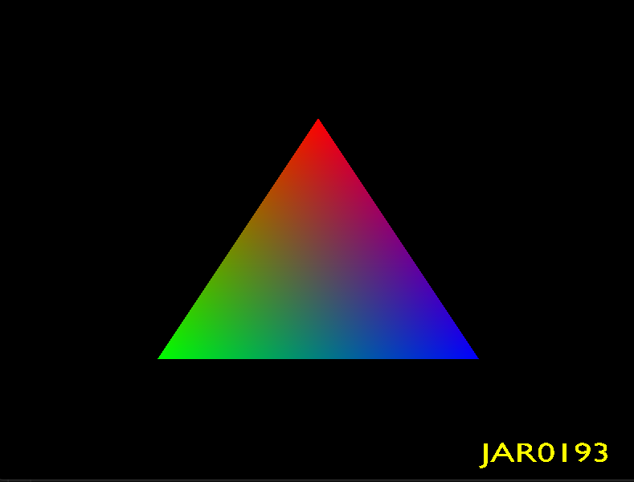
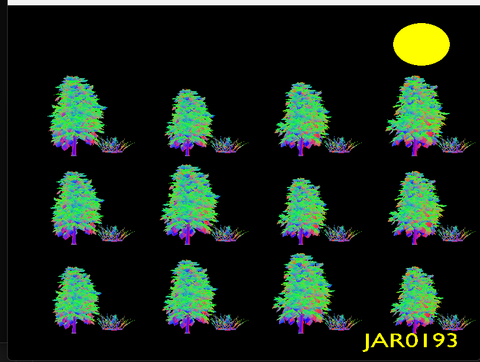
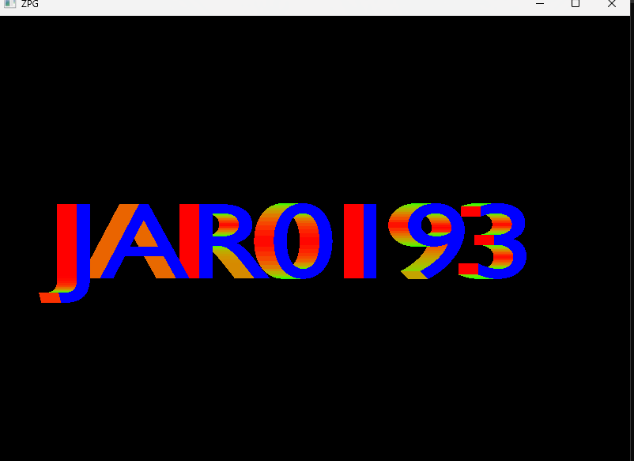
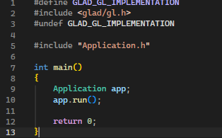
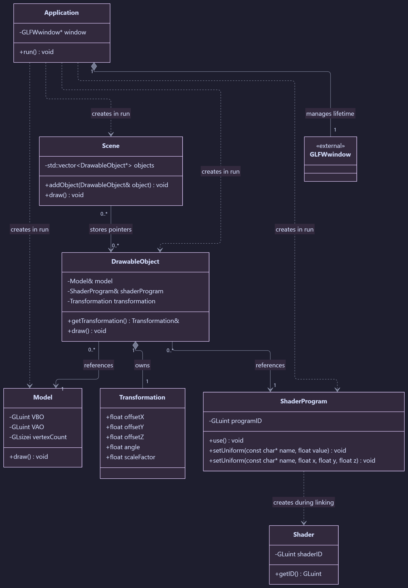

# Cvičenie 3

Martin Jarabica – jar0193

## 1. Transformácie

Splnené – posun, zmenu mierky a rotáciu počítam pomocou rovníc vo vertex shaderi a ovládam klávesmi.

## 2. Uniformné premenné

Splnené – dve preťažené metódy `setUniform()` posielajú hodnoty do shaderu a kontrolujú, či premenná existuje.

## 3. Prepínanie scén

Splnené – trieda `Scene` uchováva odkazy na objekty a medzi scénami prepínam klávesmi 1 až 4.

## 4. Testovacie scény

Splnené – vytvoril som samostatné scény s guľou, trojuholníkom, lesom a loginom.

## 5. Les

Splnené – les obsahuje 12 stromov, 12 kríkov a slnko, ktoré vidno na [obrázku lesa z bodu 4](jar0193_4c.png).

## 6. Funkcia main

Splnené – funkcia `main()` vytvorí objekt `Application` a spustí aplikáciu cez `run()`.

## 7. Vlastný login

Splnené – [3D login JAR0193](jar0193_1b.png) som vytvoril v Blenderi pomocou AI skriptu a pridal ho ako [malý podpis do ostatných scén](jar0193_4c.png).

## 8. Triedy a diagram

Splnené – kód je rozdelený do samostatných tried a ich premenné a väzby sú znázornené v [triednom diagrame](CLASS_DIAGRAM.md).

