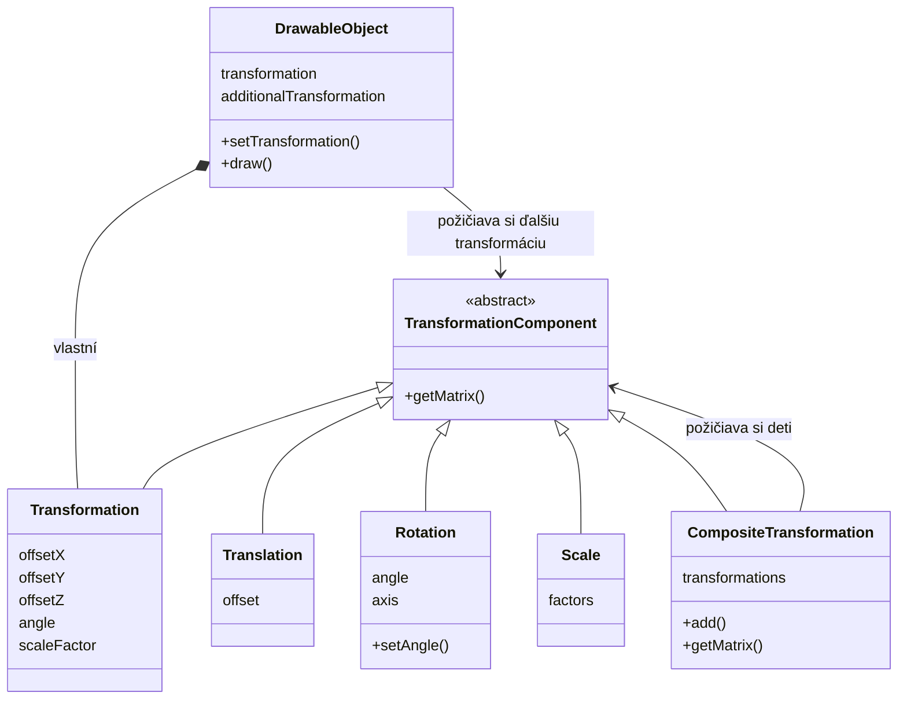

# Projektové poznámky - Úlohy 1 až 4

Autor projektu: Martin Jarabica, jar0193  
Stav poznámok: 9. 10. 2026  
Pripravené s pomocou AI na základe histórie Git, uložených zadaní, historických a aktuálnych zdrojov a konzultácií.

Poznámky opisujú vývoj projektu. Ukážky sú vybrané fragmenty, nie celé samostatne spustiteľné programy. Tvorba tejto dokumentácie nemenila zdrojový kód aplikácie.

## Číslovanie a dostupné podklady

Úlohy číslujeme podľa tém cvičení 1 až 4. Názvy existujúcich priečinkov odovzdaní majú odlišné číslovanie:

| Poznámky | Téma | Doloženie v repozitári |
|---|---|---|
| Úloha 1 | Základ aplikácie, okno a vykresľovacia slučka | Rekonštrukcia zo zachovaného úvodného kódu; samostatný skorší commit chýba. |
| Úloha 2 | Programovateľná pipeline, modely a OOP | Prvé commity a archív `Tasks/1.task`, ktorý sa označuje ako cvičenie 2. |
| Úloha 3 | Rovnice transformácií, uniformy, scény, les a login | Commity z 1. až 3. októbra a archív `Tasks/2.task`, ktorý sa označuje ako cvičenie 3. |
| Úloha 4 | Matice, Kompozit, náhodný les a slnečná sústava | Commit zo 7. októbra a ďalšie necommitnuté zmeny pracovnej verzie. |

Prvý dostupný commit už obsahuje dve gule a shadery. Preto pri úlohe 1 nepredstierame úplnú samostatne zachovanú históriu. Časť aktuálnej úlohy 4 je zatiaľ iba v pracovnom adresári, nie v poslednom commite.

## Chronológia dostupnej histórie Git

Dátumy predstavujú zaznamenané commity, nie nutne presný deň vzniku každej funkcie.

| Dátum | Commit | Význam pre vývoj projektu |
|---|---|---|
| 26. 9. 2026 | `b7704ec` | Prvý dostupný stav: projekt, knižnice, shadery a vykreslenie dvoch gúľ v rozsiahlejšom main. |
| 27. 9. 2026 | `9d7be14` | Relatívne cesty, pevné vektorové posuny vo vertex shaderoch a doplnené screenshoty. |
| 27. 9. 2026 | `9223087` | Presun kompilácie a linkovania do tried Shader a ShaderProgram. |
| 27. 9. 2026 | `3ba8f6b` | Základné OOP rozdelenie: Application, Model, DrawableObject, Scene a krátky main. |
| 27. 9. 2026 | `026f7c8` | Úprava Markdown súhrnu prvého odovzdania. |
| 1. 10. 2026 | `1894d77` | Transformácie rovnicami, uniformy, Transformation a prvé prepínanie scén. |
| 2. 10. 2026 | `157da02` | Rozšírené scény, les, vlastný login a podpis v ostatných scénach. |
| 3. 10. 2026 | `6d359ea` | Súhrn cvičenia 3, screenshoty, triedny diagram a organizácia odovzdaní. |
| 7. 10. 2026 | `35d2347` | Prechod na modelovú maticu, tretie preťaženie setUniform, základ transformácií a archivácia staršej verzie. |
| Pracovná verzia k 9. 10. 2026 | Zatiaľ bez commitu | Rotation, Scale, CompositeTransformation, priradené transformácie, náhodný les, nový formát modelov a animovaná slnečná sústava. |

## Samostatné súbory na export

- [Úloha 1](TASK_1.md)
- [Úloha 2](TASK_2.md)
- [Úloha 3](TASK_3.md)
- [Úloha 4](TASK_4.md)

Každý samostatný súbor má vlastný názov a štyri požadované časti. Nasleduje ich úplné znenie, oddelené vodorovnou čiarou.

---

# Úloha 1 - Základ projektu a vykresľovacia slučka

Autor projektu: Martin Jarabica, jar0193  
Podklady: úvodný kód z hodiny, prvý dostupný commit a následný vývoj aplikácie.  
Poznámky pripravené s pomocou AI z histórie Git, zdrojových súborov a konzultácií.

> Samostatná verzia cvičenia 1 sa v repozitári nezachovala. Prvý commit `b7704ec` z 26. 9. 2026 už obsahuje riešenie s moderným OpenGL a dvoma guľami. Táto časť preto rekonštruuje doložený základ aplikácie; netvrdí, že všetky uvedené prvky vznikli v samostatnom prvom týždni.

## 1. Týždenný prehľad

Cieľom úvodnej etapy bolo pripraviť projekt v C++, vytvoriť okno a pochopiť základný beh grafickej aplikácie. Naučili sme sa, že program potrebuje OpenGL kontext a slučku, ktorá opakovane pripravuje obraz, zobrazí ho a spracuje udalosti. Tento základ zostal zachovaný aj po presune kódu do triedy `Application`.

## 2. Čo sme spravili

- Použili sme GLFW na vytvorenie okna s rozmermi 800 × 600 a názvom ZPG.
- Pripravili sme OpenGL kontext; v zachovaných verziách aplikácia žiada OpenGL 4.3 Core Profile.
- Nastavili sme aktuálny kontext pomocou `glfwMakeContextCurrent()`.
- Zapli sme synchronizáciu výmeny obrazových bufferov pomocou `glfwSwapInterval(1)`.
- Vytvorili sme slučku, ktorá beží do zatvorenia okna.
- Pridali sme ukončenie klávesom Escape a výpis chýb GLFW.
- Prispôsobili sme vykresľovaciu oblasť veľkosti framebufferu cez `glViewport()`.
- Zabezpečili sme zrušenie okna a ukončenie GLFW pri normálnom konci aplikácie.
- Ujasnili sme si úlohy GLFW, OpenGL, GLAD a GLM, ktoré sa postupne používajú v ďalších etapách.

## 3. Ako sme to spravili (Ukážky kódu & Vysvetlenie)

### Vytvorenie okna a kontextu

Skrátená ukážka zo základu aplikácie:

```cpp
if (!glfwInit())
{
    std::exit(EXIT_FAILURE);
}

glfwWindowHint(GLFW_CONTEXT_VERSION_MAJOR, 4);
glfwWindowHint(GLFW_CONTEXT_VERSION_MINOR, 3);
glfwWindowHint(GLFW_OPENGL_PROFILE, GLFW_OPENGL_CORE_PROFILE);

GLFWwindow* window =
    glfwCreateWindow(800, 600, "ZPG", nullptr, nullptr);

if (!window)
{
    glfwTerminate();
    std::exit(EXIT_FAILURE);
}

glfwMakeContextCurrent(window);
glfwSwapInterval(1);
```

`glfwInit()` pripraví GLFW. `glfwCreateWindow()` vytvorí okno spolu s OpenGL kontextom. Kontext uchováva stav OpenGL a musí byť aktuálny vo vlákne, ktoré volá jeho funkcie.

GLFW rieši okno, klávesnicu a udalosti. OpenGL zabezpečuje grafické operácie. V ďalšej úlohe GLAD načíta adresy dostupných funkcií OpenGL a GLM neskôr poskytne vektory a matice.

### Vykresľovacia slučka

```cpp
while (!glfwWindowShouldClose(window))
{
    glClear(GL_COLOR_BUFFER_BIT | GL_DEPTH_BUFFER_BIT);

    // Draw the current scene here.

    glfwSwapBuffers(window);
    glfwPollEvents();
}
```

Jeden priechod slučkou pripraví jeden snímok. `glClear()` vymaže predchádzajúce farby a hĺbku, aby po objektoch nezostávali stopy. `glfwSwapBuffers()` zobrazí pripravený snímok a `glfwPollEvents()` spracuje vstup a udalosti okna.

`glfwSwapInterval(1)` žiada synchronizáciu výmeny bufferov s obnovovaním obrazovky. Neskôr používame aj čas medzi snímkami, aby rýchlosť pohybu nezávisela od ich počtu.

### Escape a zmena veľkosti okna

```cpp
static void key_callback(
    GLFWwindow* window, int key,
    int scancode, int action, int mods)
{
    if (key == GLFW_KEY_ESCAPE && action == GLFW_PRESS)
    {
        glfwSetWindowShouldClose(window, GLFW_TRUE);
    }
}

static void framebuffer_size_callback(
    GLFWwindow* window, int width, int height)
{
    glViewport(0, 0, width, height);
}
```

Callback je funkcia, ktorú GLFW zavolá pri konkrétnej udalosti. Escape nastaví požiadavku na zatvorenie; slučka potom skončí pri najbližšej kontrole.

V staršom kóde sa používal callback veľkosti okna. Vo výslednej aplikácii používame veľkosť framebufferu, pretože `glViewport()` potrebuje rozmery vykresľovacej plochy v pixeloch. Tie sa pri škálovaní displeja môžu líšiť od rozmerov okna.

### Ukončenie

```cpp
glfwDestroyWindow(window);
glfwTerminate();
```

Tieto volania uvoľnia okno, jeho kontext a zdroje GLFW. Neskôr sa presunuli do deštruktora `Application`.

## 4. Code Review & Poznatky

- **Okno nie je vykreslený model.** Prázdne okno potvrdzuje len časť inicializácie; na zobrazenie geometrie neskôr potrebujeme údaje vrcholov, shader program a príkaz na kreslenie.
- **Poradie inicializácie je dôležité.** Najprv pripravíme GLFW a aktuálny kontext, až potom načítame funkcie cez GLAD a vytvárame grafické zdroje.
- **Framebuffer a okno nemusia mať rovnaké rozmery v pixeloch.** Preto výsledný kód používa `glfwSetFramebufferSizeCallback()` a po vytvorení okna aj `glfwGetFramebufferSize()`.
- **Vek knižnice alebo názov komentára neurčuje verziu kontextu.** Zachovaný komentár spomínal OpenGL 3.3, ale konkrétne nastavenia žiadajú 4.3.
- **Zdroje OpenGL potrebujú platný kontext aj pri uvoľňovaní.** Modely a shader programy sa preto musia zničiť pred oknom. Toto sme neskôr vyriešili životnosťou lokálnych objektov v `Application::run()`.
- **Úvodné riešenie nadväzovalo na učiteľov kód.** Pri poznámkach rozlišujeme dodaný základ, vlastné úpravy a pomoc AI.

Súbory, do ktorých sa tento základ neskôr presunul: `Application.h`, `Application.cpp` a jednoduchý `main.cpp`.

---

# Úloha 2 - Programovateľná pipeline, modely a objektový návrh

Autor projektu: Martin Jarabica, jar0193  
Obdobie doložené v Git: 26. – 27. 9. 2026.  
Podklady: commity `b7704ec`, `9d7be14`, `9223087`, `3ba8f6b`, `026f7c8` a súhrn cvičenia 2.  
Poznámky pripravené s pomocou AI z histórie Git, zdrojových súborov a konzultácií.

## 1. Týždenný prehľad

Cieľom bolo prejsť na programovateľnú pipeline s vertex a fragment shaderom a ukladať údaje modelov cez VBO a VAO. Postupovali sme od farebného trojuholníka cez štvorec k dodanému modelu gule a dvom objektom s rozdielnymi shader programami. Nakoniec sme pôvodný rozsiahly `main.cpp` rozdelili medzi triedy a pripravili riešenie na ďalšie cvičenia.

## 2. Čo sme spravili

- Pripojili sme hlavičkovú verziu GLAD 2 a načítali funkcie OpenGL.
- Načítali sme shadery zo súborov, skompilovali ich a spojili do shader programu.
- Pridali sme kontrolu kompilácie shaderov aj linkovania programu.
- Úmyselnou chybou v shaderi sme overili výpis chyby a ukončenie aplikácie.
- Vykreslili sme trojuholník s farbou pre každý vrchol.
- Opravili sme geometriu, keď sa namiesto požadovaného trojuholníka zobrazoval štvorec alebo iba jeho spodná pravá časť.
- Vytvorili sme štvorec z dvoch trojuholníkov; jeho štvrtý geometrický roh je žltý.
- Pridali sme `sphere.h` a vypočítali počet vrcholov z veľkosti poľa.
- Vykreslili sme rovnaký model gule dvakrát: farebný a žltý.
- Po úvodnom experimente s uniformom sme podľa vtedajšej látky použili pevné vektorové posuny vo vertex shaderoch.
- Nahradili sme absolútne cesty relatívnymi cestami shaderov a cestami odvodenými od `$(ProjectDir)`.
- Zaviedli sme triedy `Shader`, `ShaderProgram`, `Model`, `DrawableObject`, `Scene` a `Application`.
- Začali sme verzovať cez Git a GitHub Desktop; pripravili sme screenshoty a Markdown súhrn.

## 3. Ako sme to spravili (Ukážky kódu & Vysvetlenie)

### GLAD iba s jednou implementáciou

```cpp
#define GLAD_GL_IMPLEMENTATION
#include <glad/gl.h>
#undef GLAD_GL_IMPLEMENTATION
```

Tento blok zostal v `main.cpp`. Makro umožní hlavičkovej verzii GLAD vložiť aj implementáciu; definujeme ho iba v jednom kompilačnom súbore. `#undef` následne zruší definíciu makra.

Po vytvorení aktuálneho kontextu voláme:

```cpp
if (!gladLoadGL((GLADloadfunc)glfwGetProcAddress))
{
    std::cerr << "GLAD initialization failed\n";
    glfwDestroyWindow(window);
    glfwTerminate();
    std::exit(EXIT_FAILURE);
}
```

GLAD cez GLFW získa adresy funkcií podporovaných ovládačom. Samotné pridanie hlavičky nestačí na ich načítanie.

### Trojuholník, údaje vrcholov a VBO + VAO

```cpp
const float triangleVertices[] = {
     0.0f,  0.5f, 0.0f,   1.0f, 0.0f, 0.0f,
    -0.5f, -0.5f, 0.0f,   0.0f, 0.0f, 1.0f,
     0.5f, -0.5f, 0.0f,   0.0f, 1.0f, 0.0f
};
```

Každý vrchol má šesť hodnôt: polohu `x, y, z` a farbu `r, g, b`. Horný vrchol má červenú farbu, ľavý dolný modrú a pravý dolný zelenú.

Skrátená verzia pôvodného nahrávania:

```cpp
glGenBuffers(1, &VBO);
glBindBuffer(GL_ARRAY_BUFFER, VBO);
glBufferData(GL_ARRAY_BUFFER, sizeof(triangleVertices),
             triangleVertices, GL_STATIC_DRAW);

glGenVertexArrays(1, &VAO);
glBindVertexArray(VAO);

glEnableVertexAttribArray(0);
glVertexAttribPointer(0, 3, GL_FLOAT, GL_FALSE,
                      6 * sizeof(float), (void*)0);

glEnableVertexAttribArray(1);
glVertexAttribPointer(1, 3, GL_FLOAT, GL_FALSE,
                      6 * sizeof(float),
                      (void*)(3 * sizeof(float)));

glDrawArrays(GL_TRIANGLES, 0, 3);
```

VBO uchováva údaje v pamäti spravovanej OpenGL. VAO uchováva nastavenie atribútov a ich väzby na buffery. Krok medzi vrcholmi, čiže stride, je šesť hodnôt typu `float`; druhý atribút začína po prvých troch.

`glDrawArrays()` dostáva počet **vrcholov**, nie počet hodnôt, bajtov ani trojuholníkov. Pri `GL_TRIANGLES` tvorí každá trojica vrcholov jeden trojuholník.

### Štvorec a žltý štvrtý roh

V použitej geometrii má štvorec štyri rôzne rohy, ale dva z nich zapisujeme dvakrát, pretože vykresľujeme dva samostatné trojuholníky. Posledný záznam patrí ľavému hornému rohu:

```cpp
-0.5f, 0.5f, 0.0f,   1.0f, 1.0f, 0.0f
```

Prvé tri hodnoty sú poloha, posledné tri žltá farba. Pre celý štvorec použijeme:

```cpp
glDrawArrays(GL_TRIANGLES, 0, 6);
```

Keď sme kreslili iba prvé tri záznamy poľa štvorca, zobrazil sa jeden z jeho trojuholníkov. Na klasický trojuholník sme preto upravili aj samotné polohy vrcholov.

### Kompilácia, linkovanie a úmyselná chyba

Kľúčová kontrola pri kompilácii shaderu:

```cpp
glShaderSource(shaderID, 1, &source, nullptr);
glCompileShader(shaderID);

GLint success = GL_FALSE;
glGetShaderiv(shaderID, GL_COMPILE_STATUS, &success);

if (!success)
{
    char infoLog[1024];
    glGetShaderInfoLog(shaderID, sizeof(infoLog), nullptr, infoLog);
    std::cerr << "Shader failed:\n" << infoLog << std::endl;
    glDeleteShader(shaderID);
    std::exit(EXIT_FAILURE);
}
```

Shader je samostatný program pre jednu časť pipeline. `ShaderProgram` spojí vertex a fragment shader cez `glAttachShader()` a `glLinkProgram()`; úspech kontroluje pomocou `GL_LINK_STATUS` a pri chybe vypíše `glGetProgramInfoLog()`.

Pri testovaní sme vynechali bodkočiarku. Hlásenie spomínajúce nečakané `out` a následne neznáme `FragColor` ukázalo, že prvá syntaktická chyba môže spôsobiť aj ďalšie hlásenia. Po overení sme bodkočiarku vrátili.

Fragment shader nastavuje farbu:

```glsl
FragColor = vec4(vertexColor, 1.0);
```

`vertexColor` už obsahuje tri zložky a `1.0` pridáva alfa zložku. Pokus `vec4(vertexColor, 1.0, 1.0)` dodáva päť zložiek, a preto neprejde kompiláciou.

### Guľa a dva shader programy

```cpp
const GLsizei sphereVertexCount = static_cast<GLsizei>(
    sizeof(sphere) / (6 * sizeof(float)));

Model sphereModel(sphere, sphereVertexCount);

ShaderProgram colorProgram(
    "shaders/basic.vert", "shaders/basic.frag");
ShaderProgram yellowProgram(
    "shaders/yellow.vert", "shaders/yellow.frag");

DrawableObject colorSphere(sphereModel, colorProgram);
DrawableObject yellowSphere(sphereModel, yellowProgram);
```

`sizeof(sphere)` je veľkosť celého poľa v bajtoch. Delenie veľkosťou jedného vrcholu dá počet vrcholov. Tento výpočet funguje tu, kde je `sphere` skutočné pole; pri obyčajnom ukazovateli by `sizeof` meralo ukazovateľ.

V konečnej verzii tejto etapy sa posuny nachádzali priamo vo vertex shaderoch:

```glsl
// basic.vert
gl_Position =
    vec4(position * 0.35 + vec3(-0.5, 0.0, 0.0), 1.0);

// yellow.vert
gl_Position =
    vec4(position * 0.35 + vec3(0.5, 0.0, 0.0), 1.0);
```

Oba objekty zdieľajú rovnaký `Model`, takže sa geometria nahrá iba raz. Každý však vyberie svoj shader program. Žltý fragment shader používa konštantnú farbu `vec4(1.0, 1.0, 0.0, 1.0)`.

Prvý dostupný commit ešte obsahuje uniform `offset`. Commit `9d7be14` zachytáva následný prechod na pevné vektorové posuny; uniformy sme systematicky doplnili až v úlohe 3.

### Rozdelenie do tried a krátky main

| Trieda | Zodpovednosť v tejto etape |
|---|---|
| `Application` | Okno, inicializácia, hlavná slučka a ukončenie. |
| `Scene` | Zoznam odkazov na objekty a ich spoločné vykreslenie. |
| `DrawableObject` | Spojenie konkrétneho modelu so shader programom. |
| `Model` | VBO, VAO a počet vrcholov. |
| `ShaderProgram` | Spojenie shaderov, aktivácia a životnosť programu. |
| `Shader` | Načítanie, kompilácia a životnosť jedného shaderu. |

```cpp
int main()
{
    Application app;
    app.run();
    return 0;
}
```

Presun kódu nezmenil základ vykresľovania. `scene.draw()` zavolá kreslenie objektov, objekt zvolí shader a model zavolá `glDrawArrays()`.

Objekt `Application` vzniká na zásobníku. Modely a programy vytvorené lokálne v `run()` sa zničia pri návrate z tejto metódy, ešte pred deštruktorom aplikácie a zrušením okna.

### Relatívne cesty a verzovanie

Shadery načítavame cez cesty ako `shaders/basic.vert`. V nastaveniach Visual Studia sú cesty ku knižniciam odvodené od `$(ProjectDir)`, takže neobsahujú konkrétne používateľské umiestnenie.

Relatívna cesta súboru shaderu sa vyhodnocuje voči pracovnému adresáru spusteného programu, nie automaticky voči umiestneniu `.cpp`. Pridanie shaderu do Solution Explorer slúži na jeho evidenciu a editovanie, ale samo osebe nemení pracovný adresár.

V GitHub Desktop rozlišujeme uloženie súboru, lokálny commit a odoslanie cez push. Úvodné publikovanie repozitára a ďalšie pushovanie sú samostatné kroky. `.gitignore` vylučuje napríklad `.vs`, `Debug` a `x64`.

## 4. Code Review & Poznatky

- **Refaktoring zachoval správanie.** Commit `9223087` presunul shadery do tried a `3ba8f6b` dokončil základné OOP rozdelenie. Nárast počtu riadkov súvisel aj s deklaráciami, kontrolami chýb a správou zdrojov.
- **Referencia na model je zámerná.** `DrawableObject` si model požičiava; nevlastní ho. Umožňuje to vykresliť jednu geometriu viackrát bez duplikácie VBO. Model musí existovať počas každého vykreslenia objektu.
- **Definície metód patria mimo telo konštruktora.** Pri tvorbe `Model.cpp` sme opravili nesprávne vnorené definície `draw()` a deštruktora.
- **Deštruktory zostali potrebné.** `Model` uvoľňuje VAO a VBO, `ShaderProgram` program a `Shader` samostatný shader. Kopírovanie tried vlastniacich tieto identifikátory je zakázané, aby sa rovnaký zdroj neuvoľnil dvakrát.
- **Farba a normála sú rôzne údaje.** Trojuholník má na druhom atribúte RGB farbu. Dodaná guľa vo formáte `x, y, z, nx, ny, nz` má normálu, ktorej zložky sme dočasne zobrazovali ako farbu.
- **Počítame vrcholy, až potom trojuholníky.** Pri poli so 17 280 hodnotami a šiestimi hodnotami na vrchol vychádza 2 880 vrcholov, teda 960 samostatných trojuholníkov.
- **Test hĺbky a drôtový model sú rozdielne veci.** Vypnutý test hĺbky v historickej ukážke spôsoboval prekrývanie plôch. Skutočné hrany trojuholníkov by sme zobrazili cez `glPolygonMode(GL_FRONT_AND_BACK, GL_LINE)`.
- **Podoba posledného snímku nemusí ukazovať všetky staršie kroky.** Trojuholník, chyba shaderu a štvorec sú doložené samostatnými screenshotmi, hoci konečný program tejto etapy zobrazuje dve gule.

Historické screenshoty a súhrn sú uložené v priečinku `Tasks/1.task`. Číslo priečinka označuje prvé odovzdanie na Kelvin, jeho obsah však patrí ku cvičeniu 2.

---

# Úloha 3 - Transformácie rovnicami, scény, les a vlastný login

Autor projektu: Martin Jarabica, jar0193  
Obdobie doložené v Git: 1. – 3. 10. 2026.  
Podklady: commity `1894d77`, `157da02`, `6d359ea` a archivované zdroje cvičenia 3.  
Poznámky pripravené s pomocou AI z histórie Git, zdrojových súborov a konzultácií.

## 1. Týždenný prehľad

Cieľom bolo ovládať posun, mierku a rotáciu cez uniformné premenné, zatiaľ bez transformačných matíc. Rozšírili sme aplikáciu o prepínateľné scény s loginom, guľou, trojuholníkom a lesom. Vlastný 3D login sme vytvorili pomocou Blenderu a pridali ho aj ako podpis do ostatných scén.

## 2. Čo sme spravili

- Zaviedli sme uniformy `offset`, `angle` a `scaleFactor`.
- Pridali sme dve preťažené metódy `ShaderProgram::setUniform()` pre jeden `float` a tri hodnoty typu `float`.
- Pri každom nastavovaní uniformu kontrolujeme výsledok `glGetUniformLocation()` na hodnotu `-1`.
- Rotáciu okolo osi Y sme vo vertex shaderi počítali priamo pomocou sínusu a kosínusu.
- Opravili sme chybný zápis rotačnej rovnice: chýbajúce znamienko a použitie súradnice Y tam, kde mala byť Z.
- Odstránili sme závislosť základného posunu od dvoch rôznych vertex shaderov; oba programy mohli používať `basic.vert`.
- Zobrazované zložky normál sme upravili cez `abs()`.
- Do `DrawableObject` sme pridali vlastný stav transformácie a metódu `getTransformation()`.
- Pridali sme ovládanie šípkami, Q/E a Z/X, s pohybom závislým od času.
- Rozšírili sme použitie `Scene` na štyri samostatné scény, prepínané klávesmi 1 až 4.
- Vytvorili sme les s 12 stromami, 12 kríkmi a slnkom. V tejto etape bolo rozloženie pravidelné.
- Použili sme dodaný model OpenGL textu a následne vlastný model `JAR0193`.
- Vygenerovali sme vlastný login v Blenderi pomocou AI skriptu, exportovali ho ako pole vrcholov a pridali podpis do ďalších scén.
- Zapli sme test hĺbky, pripravili triedny diagram, screenshoty a súhrn odovzdania.
- Vlastné komentáre sme upravovali na angličtinu podľa zadania.

## 3. Ako sme to spravili (Ukážky kódu & Vysvetlenie)

### Dve preťažené metódy na uniformy

Deklarácie tejto etapy v `ShaderProgram.h`:

```cpp
void setUniform(const char* name, float value) const;
void setUniform(
    const char* name, float x, float y, float z) const;
```

Preťaženie znamená, že metódy majú rovnaký názov, ale odlišné parametre. Kompilátor vyberie správnu podľa toho, či posielame jednu hodnotu alebo tri.

Príklad implementácie pre trojzložkový vektor:

```cpp
void ShaderProgram::setUniform(
    const char* name, float x, float y, float z) const
{
    GLint location = glGetUniformLocation(programID, name);

    if (location == -1)
    {
        std::cerr << "Uniform not found: " << name << std::endl;
        std::exit(EXIT_FAILURE);
    }

    use();
    glUniform3f(location, x, y, z);
}
```

Jednohodnotová verzia vykoná rovnakú kontrolu a zavolá `glUniform1f(location, value)`. Pred odoslaním aktivuje príslušný shader program, pretože `glUniform*` mení uniformy aktuálne používaného programu.

`location` je identifikátor konkrétnej aktívnej uniformnej premennej v konkrétnom programe. Hodnota `-1` môže znamenať chybný názov, chýbajúcu premennú alebo premennú, ktorú kompilátor odstránil, pretože neovplyvňuje výsledok.

### Posun, mierka a rotácia bez matíc

Podstatná časť historického `basic.vert`:

```glsl
uniform vec3 offset;
uniform float angle;
uniform float scaleFactor;

void main()
{
    vertexColor = abs(color);

    vec3 rotatedPosition;
    rotatedPosition.x = cos(angle) * position.x
                      + sin(angle) * position.z;
    rotatedPosition.y = position.y;
    rotatedPosition.z = -sin(angle) * position.x
                      + cos(angle) * position.z;

    gl_Position =
        vec4(rotatedPosition * scaleFactor + offset, 1.0);
}
```

Pri rotácii okolo Y sa menia súradnice X a Z; Y zostáva rovnaké. Uhol je v radiánoch. Napríklad približne `1.5708` radiánu je 90 stupňov.

Najprv vypočítame otočenú polohu, potom ju násobíme mierkou a nakoniec pripočítame posun. Jednotná mierka mení všetky tri súradnice rovnako. Posun potom umiestni objekt do scény.

`abs(color)` použijeme po zložkách. Pri modeloch, ktorých druhý atribút obsahuje normálu, sa tak záporné zložky zmenia na kladné a dajú sa zobraziť ako farba. Pri bežných RGB farbách v rozsahu 0 až 1 sa hodnota nezmení.

### Každý objekt má svoj stav transformácie

V tejto etape bola `Transformation` jednoduchá trieda s hodnotami:

```cpp
class Transformation
{
public:
    float offsetX = 0.0f;
    float offsetY = 0.0f;
    float offsetZ = 0.0f;
    float angle = 0.0f;
    float scaleFactor = 1.0f;
};
```

`DrawableObject::draw()` pred každým vykreslením poslal stav svojho objektu:

```cpp
shaderProgram.setUniform(
    "offset",
    transformation.offsetX,
    transformation.offsetY,
    transformation.offsetZ);

shaderProgram.setUniform("angle", transformation.angle);
shaderProgram.setUniform("scaleFactor", transformation.scaleFactor);

model.draw();
```

Viac objektov môže zdieľať jeden shader program. Uniformy si preto nastavíme vždy pred kreslením konkrétneho objektu, aby dostal svoju polohu a veľkosť.

### Prepínanie scén

`Scene` už vznikla pri predchádzajúcom refaktoringu. Teraz sme pripravili viac jej inštancií a vyberali aktívnu:

```cpp
Scene* activeScene = &scene;
DrawableObject* activeObject = &logoObject;

if (glfwGetKey(window, GLFW_KEY_2) == GLFW_PRESS)
{
    activeScene = &sphereScene;
    activeObject = &sphereObject;
}

activeScene->draw();
```

Výber scény určuje, ktoré objekty kreslíme. `activeObject` samostatne určuje objekt ovládaný klávesnicou.

| Kláves | Scéna v úlohe 3 | Ovládaný objekt |
|---|---|---|
| 1 | Vlastný login | Login |
| 2 | Guľa | Guľa |
| 3 | Trojuholník | Trojuholník |
| 4 | Les | Prvý strom |

`Scene::addObject()` uchováva adresu objektu a `Scene::draw()` volá jeho metódu `draw()`. Scéna objekty automaticky nevlastní ani nemaže. V našom riešení sú vytvorené lokálne v `Application::run()` a existujú počas celej slučky.

### Ovládanie nezávislé od počtu snímkov

```cpp
double currentTime = glfwGetTime();
float deltaTime = static_cast<float>(currentTime - lastTime);
lastTime = currentTime;

Transformation& transform = activeObject->getTransformation();

if (glfwGetKey(window, GLFW_KEY_RIGHT) == GLFW_PRESS)
{
    transform.offsetX += speed * deltaTime;
}
```

`deltaTime` je počet sekúnd od predchádzajúceho snímku. Ak sa za jednu sekundu vykreslí viac snímkov, jednotlivé kroky sú menšie, ale celkový posun za sekundu zostáva rovnaký.

Šípky menia X/Y posun, Q/E uhol a Z/X mierku. Mierku obmedzujeme minimom `0.05f`, aby sa ovládaný objekt nezmenšil na nulu.

### Les a zdieľané modely

Základ pôvodného pravidelného rozloženia stromov:

```cpp
const int treeCount = 12;
std::vector<DrawableObject> trees;
trees.reserve(treeCount);

for (int i = 0; i < treeCount; ++i)
{
    trees.emplace_back(treeModel, colorProgram);

    DrawableObject& treeObject = trees.back();
    Transformation& t = treeObject.getTransformation();

    int column = i % 4;
    int row = i / 4;

    t.offsetX = -0.72f + 0.48f * column;
    t.offsetY = -0.85f + 0.50f * row;
    t.scaleFactor = 0.05f + 0.005f * (i % 3);
    t.angle = 0.2f * column;

    forestScene.addObject(treeObject);
}
```

Dvanásť stromov má jeden spoločný `treeModel`, ale každý vlastnú transformáciu. Podobne vytvárame 12 kríkov; slnko používa model gule so žltým shaderom.

`reserve(treeCount)` vopred zabezpečí kapacitu pre plánovaný počet objektov. Je to potrebné, pretože scéna uchováva ich adresy a bežné zväčšenie vektora by mohlo objekty presunúť. Táto ochrana platí pre plánovaný počet; pridanie ďalších objektov nad rezervovanú kapacitu si vyžaduje novú úvahu o životnosti adries.

### Vlastný 3D login a podpis

Pomocou AI sme pripravili Blender skript na vytvorenie textu `JAR0193`, pridanie hĺbky, prevod na mesh, trianguláciu a export polohy a normály každého vrcholu. Model sa normalizoval do rozsahu približne -1 až 1 so zachovaním pomerov.

Výsledný `Login.h` obsahuje pole `loginVertices`, 6 276 vrcholov a 2 092 trojuholníkov. Hlavička uvádza autora, login, formát aj použitie AI.

```cpp
const GLsizei logoVertexCount = static_cast<GLsizei>(
    sizeof(loginVertices) / (6 * sizeof(float)));

Model logoModel(loginVertices, logoVertexCount);
DrawableObject logoObject(logoModel, colorProgram);
DrawableObject signatureObject(logoModel, yellowProgram);

Transformation& t = signatureObject.getTransformation();
t.offsetX = 0.70f;
t.offsetY = -0.90f;
t.offsetZ = -0.80f;
t.scaleFactor = 0.20f;

sphereScene.addObject(signatureObject);
triangleScene.addObject(signatureObject);
forestScene.addObject(signatureObject);
```

Hlavný login a malý podpis zdieľajú geometriu. Podpis má vlastný shader a transformáciu; ten istý podpisový objekt môže byť pridaný do viacerých scén.

Pre správne zakrývanie povrchov používame `glEnable(GL_DEPTH_TEST)` a pri každom snímku čistíme aj depth buffer. Viditeľná hĺbka písmen vychádza z modelu, nie z hotového osvetľovacieho systému.

## 4. Code Review & Poznatky

- **Preťaženie nie je duplicitná definícia.** Dve metódy s rovnakým názvom a rôznymi parametrami sú zámerné; tú istú signatúru však nemôžeme definovať dvakrát.
- **Uniform nie je súčasť každého vrcholu.** Je to hodnota spoločná pre dané kreslenie, napríklad posun celého objektu. Polohy jednotlivých vrcholov prichádzajú ako atribúty z VBO.
- **Shader musí uniform skutočne používať.** Samotná deklarácia nemusí zaručiť platné `location`. Po zmene názvov alebo shaderu kontrolujeme, čo aplikácia posiela.
- **Nulová mierka môže skryť celý model.** Pri diagnostike prázdneho okna je preto dôležité overiť nastavenie mierky, údaje modelu, pridanie do scény, aktívny shader a volanie kreslenia.
- **Rotácia modelu nie je pohyb kamery.** V tejto etape prepočítavame samotné vrcholy, nie pohľad na scénu.
- **Volanie `scene.draw()` nenahradilo model novou geometriou.** Len presunulo iterovanie cez objekty do triedy zodpovednej za scénu.
- **`glUseProgram(0)` zruší výber aktuálneho programu.** Nevymaže program ani hodnoty uniformov. Pri kreslení v Core Profile však potrebujeme znovu aktivovať platný program.
- **Dôležité je skutočné vlastníctvo.** `Application` vlastní životnosť okna; modely, programy, objekty a scény vytvára v `run()`. `Scene` ukladá ukazovatele a `DrawableObject` referencie. Diagram má opisovať tieto skutočné väzby.
- **Historický les bol pravidelný.** Náhodné rozloženie patrí až do úlohy 4; v poznámkach tieto verzie nezamieňame.
- **Podmienky odovzdania sa týkajú aj pôvodu kódu.** Učiteľove modely neupravujeme; vlastné súbory majú mať autora a login a pomoc AI musí byť uvedená. V aktuálnom projekte ešte nie sú tieto hlavičky doplnené všade.

Postup je doložený commitom `1894d77` pre rovnice a prvé prepínanie, `157da02` pre rozšírené scény a login a `6d359ea` pre súhrn, screenshoty a diagram.

Archivované zdroje a screenshoty sú v `Tasks/2.task`, teda v druhom odovzdaní na Kelvin. Súhrn označuje túto etapu ako cvičenie 3.

---

# Úloha 4 - Modelové matice, Kompozit a slnečná sústava

Autor projektu: Martin Jarabica, jar0193  
Obdobie: od commitu `35d2347` zo 7. 10. 2026 po pracovnú verziu z 9. 10. 2026.  
Podklady: aktuálny zdrojový kód, zmeny oproti HEAD, zadania LMS/Kelvin a konzultácie.  
Poznámky pripravené s pomocou AI; ide o review a dokumentáciu, nie o úpravu implementácie.

## 1. Týždenný prehľad

Cieľom je nahradiť transformačné rovnice modelovou maticou 4 × 4 a umožniť objektom používať jednotlivé aj zložené transformácie. Na skladanie používame návrhový vzor Kompozit, overujeme vplyv poradia násobenia a rozširujeme les o náhodné rozloženie. V novej slnečnej sústave kombinujeme obiehanie, vlastnú rotáciu a mierku Slnka, Zeme a Mesiaca; funkcie sú implementované, ale podklady odovzdania ešte nie sú dokončené.

## 2. Čo sme spravili

- Pridali sme tretie preťaženie `ShaderProgram::setUniform()` pre `glm::mat4`.
- Nahradili sme uniformy `offset`, `angle` a `scaleFactor` vo vykresľovacom vertex shaderi jedným `modelMatrix`.
- Do `Transformation` sme pridali `getMatrix()`, ktoré vytvára maticu z hodnôt ovládaných klávesnicou.
- Zaviedli sme spoločné rozhranie `TransformationComponent` a triedy `Translation`, `Rotation`, `Scale` a `CompositeTransformation`.
- Vysvetlili sme si Kompozit na samostatnom malom príklade; jeho spustenie bolo potvrdené v konzultácii, ale samostatný testovací projekt nie je uložený v tomto repozitári.
- Pridali sme `DrawableObject::setTransformation()` na priradenie ďalšej transformácie alebo kompozitu.
- Zachovali sme pôvodné klávesové ovládanie a kombinujeme ho s priradenou transformáciou.
- Na trojuholníku sme vyskúšali poradie posunu a rotácie; aktuálne používa kombináciu `R * T * S` a automaticky sa animuje.
- Pravidelné rozmiestnenie lesa sme nahradili náhodným posunom, mierkou a rotáciou. Zostalo 12 stromov, 12 kríkov, slnko a podpis.
- Rozšírili sme `Model` o podporu šiestich alebo deviatich hodnôt na vrchol.
- Pridali sme učiteľove farebné modely `sun.h`, `earth.h` a `moon.h`.
- Vytvorili sme piatu scénu a hierarchicky zložili obežné dráhy Zeme a Mesiaca.
- Pridali sme vlastnú rotáciu Zeme, Mesiaca aj Slnka.
- Vyskúšali sme rôzne osi a podľa požadovaného vzhľadu vrátili obežné dráhy do roviny obrazovky.
- Po opravách solárnej scény sme úspešne zostavili Debug x64. Pri zostavení zostáva linkerové upozornenie `LNK4098`.

## 3. Ako sme to spravili (Ukážky kódu & Vysvetlenie)

### Jedna matica namiesto samostatných rovníc

Pôvodný vertex shader mal:

```glsl
gl_Position =
    vec4(rotatedPosition * scaleFactor + offset, 1.0);
```

Aktuálny shader používa:

```glsl
uniform mat4 modelMatrix;

void main()
{
    vertexColor = abs(color);
    gl_Position = modelMatrix * vec4(position, 1.0);
}
```

Matica obsahuje kombináciu posunu, rotácie a mierky. Shader ju použije pre každý vrchol, takže údaje modelu vo VBO nemusíme pri animácii prepisovať.

`vec4(position, 1.0)` vytvára homogénne súradnice bodu. Štvrtá zložka umožňuje zapísať aj posun ako násobenie maticou; smerový vektor by pri čisto afinných transformáciách používal `w = 0`, aby ho posun neovplyvnil.

Použitie matice 4 × 4 samo osebe nevytvorí perspektívu. Aktuálny shader zapisuje priamo do clip space a používané afinné matice zachovávajú `w = 1`; view a projekčnú maticu zatiaľ nemáme. Kamera a perspektívne premietanie sú uvedené ako látka pre ďalšie cvičenie.

### Poslanie matice cez uniform

Deklarácia nového preťaženia:

```cpp
void setUniform(
    const char* name, const glm::mat4& matrix) const;
```

Jadro implementácie v `ShaderProgram.cpp`:

```cpp
GLint location = glGetUniformLocation(programID, name);

if (location == -1)
{
    std::cerr << "Uniform not found: " << name << '\n';
    std::exit(EXIT_FAILURE);
}

use();
glUniformMatrix4fv(
    location, 1, GL_FALSE, glm::value_ptr(matrix));
```

Ide o skrátenú ukážku s upraveným textom hlásenia; v aktuálnom zdrojovom súbore je ešte preklep `Uniform not foundL:`.

`1` znamená jednu maticu, `GL_FALSE` znamená bez transpozície a `glm::value_ptr()` poskytne ukazovateľ na jej hodnoty. Pred odoslaním vyberieme shader program. Všetky tri preťaženia `setUniform()` zostali v triede, hoci súčasné kreslenie objektov používa maticovú verziu.

### Základná Transformation používa GLM

Skrátená, významovo zhodná verzia `Transformation::getMatrix()`:

```cpp
glm::mat4 matrix(1.0f);
matrix = glm::translate(
    matrix, glm::vec3(offsetX, offsetY, offsetZ));
matrix = glm::rotate(
    matrix, angle, glm::vec3(0.0f, 1.0f, 0.0f));
matrix = glm::scale(matrix, glm::vec3(scaleFactor));
return matrix;
```

`glm::mat4(1.0f)` je jednotková matica, ktorá bod nemení. Tieto volania vytvoria `T * R * S`; pri násobení stĺpcovým vektorom sa na vrchol najprv uplatní S, potom R a nakoniec T.

Trieda tak zachovala hodnoty a ovládanie z úlohy 3, ale namiesto odosielania troch samostatných uniformov poskytuje jednu maticu.

### Rozhranie a listy Kompozitu

```cpp
class TransformationComponent
{
public:
    virtual ~TransformationComponent() = default;
    virtual glm::mat4 getMatrix() const = 0;
};
```

Spoločné rozhranie umožňuje pýtať si maticu bez toho, aby volajúci musel vedieť, či ide o jednu rotáciu alebo celú skupinu transformácií.

`Translation` vytvára maticu cez `glm::translate()`, `Scale` cez `glm::scale()` a `Rotation` cez `glm::rotate()`. Rotácia navyše umožňuje meniť uhol:

```cpp
void Rotation::setAngle(float angleInRadians)
{
    angle = angleInRadians;
}

glm::mat4 Rotation::getMatrix() const
{
    glm::mat4 matrix(1.0f);
    matrix = glm::rotate(matrix, angle, axis);
    return matrix;
}
```

Samostatné názvy `Translation`, `Rotation` a `Scale` sú naše implementačné rozhodnutie. Kelvin požaduje Kompozit; netvrdíme, že učiteľ predpísal presne tieto názvy alebo že iba takto možno riešenie vytvoriť.

### Skupina transformácií

```cpp
void CompositeTransformation::add(
    TransformationComponent& transformation)
{
    transformations.push_back(&transformation);
}

glm::mat4 CompositeTransformation::getMatrix() const
{
    glm::mat4 matrix(1.0f);

    for (const TransformationComponent* transformation
         : transformations)
    {
        matrix = matrix * transformation->getMatrix();
    }

    return matrix;
}
```

Kompozit má rovnaké rozhranie ako jednotlivá transformácia. Uchováva odkazy na deti a násobí ich matice v poradí pridania. Dieťa môže byť ďalší kompozit, takže vzniká hierarchia.

Pri pridaní T, R, S je výsledok `T * R * S`. Poradie uložených matíc však nie je poradie účinkov na vrchol: ten sa spracúva sprava doľava.

Schematický diagram vzťahov používaných pri transformáciách:



Tento diagram je súčasť poznámok. Samostatný pôvodný `CLASS_DIAGRAM.md` v koreňovom priečinku zostáva diagramom úlohy 3.

### Priradenie transformácie objektu

Aktuálne riešenie v `DrawableObject.cpp`:

```cpp
void DrawableObject::setTransformation(
    const TransformationComponent& newTransformation)
{
    additionalTransformation = &newTransformation;
}

void DrawableObject::draw() const
{
    glm::mat4 modelMatrix = transformation.getMatrix();

    if (additionalTransformation != nullptr)
    {
        modelMatrix =
            modelMatrix * additionalTransformation->getMatrix();
    }

    shaderProgram.use();
    shaderProgram.setUniform("modelMatrix", modelMatrix);
    model.draw();
}
```

Objekt naďalej vlastní základnú transformáciu ovládanú klávesnicou. Ďalšiu transformáciu si požičiava cez ukazovateľ. Pri kreslení obe spojí.

`setTransformation()` neuloží jednu nemennú kópiu matice. Uchová adresu transformácie a pri každom snímku si z nej vypýta aktuálnu maticu. Preto sa zmena uhla cez `setAngle()` okamžite prejaví pri ďalšom kreslení.

### Test poradia na trojuholníku

Používame posun `(0.4, 0, 0)`, rotáciu približne 45° okolo Z a mierku `0.6`.

Variant A:

```cpp
triangleMovement.add(triangleTranslation);
triangleMovement.add(triangleRotation);
```

Výsledok po pridaní mierky je `T * R * S`: najprv zmenšenie, potom otočenie okolo lokálneho počiatku a nakoniec posun doprava.

Variant B, ktorý je teraz v aplikácii:

```cpp
triangleMovement.add(triangleRotation);
triangleMovement.add(triangleTranslation);
```

Výsledok je `R * T * S`: po zmenšení sa objekt posunie a potom sa otočí aj jeho posunutá poloha. Lokálny počiatok modelu sa pri uvedenom uhle premiestni z `(0.4, 0, 0)` približne na `(0.283, 0.283, 0)`.

Pri animácii variantu B trojuholník obieha okolo počiatku scény. Násobenie matíc vo všeobecnosti nie je komutatívne, preto `T * R` a `R * T` dávajú iný výsledok.

Test sme počas vývoja vyskúšali, ale dvojica finálnych screenshotov tejto úlohy ešte nie je doložená v repozitári. Pri porovnávaní treba ponechať rovnaký uhol a dočasne zastaviť jeho automatické zväčšovanie; v kontrolovanej aktuálnej verzii zväčšovanie ešte beží.

### Náhodný les

Namiesto riadkov a stĺpcov teraz vytvárame náhodné hodnoty:

```cpp
std::mt19937 forestGenerator(std::random_device{}());

std::uniform_real_distribution<float> forestX(-0.75f, 0.75f);
std::uniform_real_distribution<float> forestY(-0.80f, 0.20f);
std::uniform_real_distribution<float> forestAngle(0.0f, 6.283185f);
std::uniform_real_distribution<float> treeScaleRange(0.04f, 0.06f);
std::uniform_real_distribution<float> bushScaleRange(0.15f, 0.25f);

t.offsetX = forestX(forestGenerator);
t.offsetY = forestY(forestGenerator);
t.scaleFactor = treeScaleRange(forestGenerator);
t.angle = forestAngle(forestGenerator);
```

Kríky používajú vlastný rozsah mierky. Náhodné hodnoty nastavujeme pri vytváraní objektov pred slučkou, takže les neskáče na nové miesta pri každom snímku. Znovu sa vygeneruje pri ďalšom spustení aplikácie.

Aj bez samostatného kompozitu pre každý strom používa les triedu `Transformation`, ktorej matica už skladá posun, rotáciu a mierku.

### Modely so šiestimi alebo deviatimi hodnotami na vrchol

Pôvodná verzia `Model` predpokladala vždy šesť hodnôt. Nové modely planét obsahujú deväť:

| Formát | Údaje | Krok medzi vrcholmi |
|---|---|---|
| 6 hodnôt | XYZ + RGB alebo XYZ + normála | `6 * sizeof(float)` |
| 9 hodnôt | XYZ + RGB + normála | `9 * sizeof(float)` |

V deklarácii konštruktora je predvolená hodnota 6, takže staršie volania netreba meniť. Nové modely dostávajú tretí argument 9.

Podstatná zmena:

```diff
- vertexCount * 6 * sizeof(float)
+ vertexCount * valuesPerVertex * sizeof(float)

- 6 * sizeof(float)
+ stride
```

V aktuálnej implementácii sa veľkosť bufferu počíta s prevodom počtu vrcholov na `GLsizeiptr`; `stride` sa vypočíta z `valuesPerVertex * sizeof(float)`.

Pre deväť hodnôt pridávame samostatnú normálu:

```cpp
if (valuesPerVertex == 9)
{
    glEnableVertexAttribArray(2);
    glVertexAttribPointer(
        2, 3, GL_FLOAT, GL_FALSE, stride,
        (void*)(6 * sizeof(float)));
}
```

Atribút 0 je poloha, 1 je farba a 2 je normála. Učiteľove modely nemeníme; upravili sme ich interpretáciu v našom kóde. Každý z troch planetárnych modelov má podľa dodaných hlavičiek 11 520 vrcholov, teda 3 840 trojuholníkov.

### Slnečná sústava a oddelené transformácie

Zem má zvlášť obežnú dráhu, vlastnú rotáciu a mierku:

```cpp
Translation earthDistance(0.55f, 0.0f, 0.0f);
Rotation earthOrbitRotation(0.0f, 0.0f, 0.0f, 1.0f);

CompositeTransformation earthOrbit;
earthOrbit.add(earthOrbitRotation);
earthOrbit.add(earthDistance);

Rotation earthSpin(0.0f, 1.0f, 0.0f, 0.0f);
Scale earthScale(0.10f, 0.10f, 0.10f);

CompositeTransformation earthTransformation;
earthTransformation.add(solarSunObject.getTransformation());
earthTransformation.add(earthOrbit);
earthTransformation.add(earthSpin);
earthTransformation.add(earthScale);

earthObject.setTransformation(earthTransformation);
```

Mesiac preberá obežnú dráhu Zeme, ale nepreberá jej vlastnú rotáciu ani mierku:

```cpp
CompositeTransformation moonTransformation;
moonTransformation.add(solarSunObject.getTransformation());
moonTransformation.add(earthOrbit);
moonTransformation.add(moonOrbit);
moonTransformation.add(moonSpin);
moonTransformation.add(moonScale);

moonObject.setTransformation(moonTransformation);
```

`moonOrbit` podobne obsahuje rotáciu a posun, tentoraz vo vzdialenosti `0.20` od Zeme. Mierka Mesiaca je `0.045`.

Ak spoločnú transformáciu ovládanú klávesnicou označíme G, výsledné zloženie je:

```text
Slnko: G * vlastná rotácia Slnka * mierka Slnka
Zem:   G * obeh Zeme * posun Zeme * vlastná rotácia Zeme * mierka Zeme
Mesiac:G * obeh Zeme * posun Zeme * obeh Mesiaca * posun Mesiaca
          * vlastná rotácia Mesiaca * mierka Mesiaca
```

Preberáme `solarSunObject.getTransformation()`, teda základnú transformáciu G. Nepreberáme celý kompozit Slnka s jeho mierkou a vlastnou rotáciou. Tým zabránime tomu, aby zmenšenie Slnka skrátilo aj obežné dráhy alebo jeho vlastná rotácia poháňala všetky planéty.

Keď je v scéne 5 ovládaným objektom Slnko, klávesnica mení spoločnú transformáciu sústavy. Podpis je samostatný objekt a tento spoločný pohyb nepreberá.

### Dynamická animácia a voľba osí

Aktuálne rýchlosti obežných dráh:

```cpp
earthOrbitAngle += 0.2f * deltaTime;
moonOrbitAngle += 1.2f * deltaTime;
earthOrbitRotation.setAngle(earthOrbitAngle);
moonOrbitRotation.setAngle(moonOrbitAngle);

solarSunSpinAngle += 0.4f * deltaTime;
solarSunSpin.setAngle(solarSunSpinAngle);
```

| Pohyb | Os | Rýchlosť v radiánoch za sekundu |
|---|---|---|
| Zem obieha Slnko | Z | 0.2 |
| Mesiac obieha Zem vo svojom nadradenom rámci | Z | 1.2 |
| Vlastná rotácia Zeme | X | 0.8 |
| Vlastná rotácia Mesiaca | X | 0.6 |
| Vlastná rotácia Slnka | Y | 0.4 |

Mesiac navyše preberá rotáciu obežného rámca Zeme; uvedená rýchlosť 1.2 je rýchlosť jeho vlastného kompozitu `moonOrbit`.

Rotácia okolo Z prebieha v rovine XY, preto dráhy vidíme ako kružnice v rovine obrazovky pri základnom nastavení sústavy. Pri skúške osi Y prebiehalo obiehanie v rovine XZ a bez naklonenia pohľadu vyzeralo ako pohyb zľava doprava s meniacou sa hĺbkou. Vrátili sme dráhy na Z, ponechali vlastné rotácie planét na X a doplnili vlastnú rotáciu Slnka na Y.

### Čo sa vykoná v jednom snímku

1. Zmeriame `deltaTime` a aktualizujeme uhly.
2. Vyberieme aktívnu scénu a spracujeme klávesové ovládanie.
3. Vyčistíme farebný aj hĺbkový buffer.
4. Scéna zavolá `DrawableObject::draw()` pre svoje objekty.
5. Objekt vypočíta výslednú maticu a pošle ju do shaderu.
6. `Model::draw()` pripojí VAO a zavolá `glDrawArrays()`.
7. Vertex shader prepočíta polohy; OpenGL zostaví a rasterizuje trojuholníky.
8. Fragment shader nastaví farbu a test hĺbky rieši zakrývanie povrchov.
9. Výmenou bufferov zobrazíme snímok a spracujeme udalosti.

Geometria zostáva vo VBO rovnaká. `GL_STATIC_DRAW` je preto primerané aj pri týchto animovaných objektoch: mení sa matica, nie nahrané vrcholy.

## 4. Code Review & Poznatky

- **Kompozit má spoločné rozhranie pre list aj skupinu.** Na to potrebujeme virtuálne `getMatrix()`; názvy konkrétnych tried sú náš návrh.
- **Poradie transformácií má viditeľný význam.** Pri `R * T` sa otáča aj posunutá poloha. Pri `T * R` sa otočený model až následne premiestni.
- **Stred otáčania závisí od počiatku modelu.** Vlastná rotácia sa deje okolo lokálneho počiatku. Pri modeli, ktorý nie je vhodne centrovaný, nemusí ísť o jeho geometrický stred.
- **Životnosť vypožičaných transformácií je nutná podmienka.** `CompositeTransformation` deti nevlastní a `DrawableObject` nevlastní priradený kompozit. Naše transformácie sú lokálne premenné existujúce počas celej slučky; odkaz na dočasný alebo už zaniknutý objekt by bol chybný.
- **Ovládanie a dodatočný kompozit sú dve vrstvy.** Základný stav objektu zostal zachovaný kvôli klávesnici. Ďalší kompozit sa násobí za ním, takže zmena základného stavu ovplyvní aj celý priradený pohyb.
- **Mesiac musí zdieľať polohu Zeme, nie jej veľkosť.** Oddelený `earthOrbit` zabraňuje nechcenému zmenšeniu dráhy Mesiaca alebo preberaniu vlastného pretáčania povrchu Zeme.
- **Parameter formátu musí ovplyvniť všetky potrebné miesta.** Nestačilo doplniť tretí parameter konštruktora `Model`, keď veľkosť bufferu a stride stále používali pevnú šestku. Opravili sme obe miesta a pridali tretí atribút.
- **Deštruktor Model zostal zachovaný.** Stále uvoľňuje VAO a VBO; rozšírenie formátu túto zodpovednosť nemení.
- **Referencie sa inicializujú pri vytváraní objektu.** Inicializačný zoznam v konštruktore `DrawableObject` je potrebný pre jeho referenčné členy. Číselné členy v jednoduchších triedach sme podľa preferencie priraďovali v tele konštruktora.
- **Planéty majú farby vrcholov, nie hotový systém textúr alebo osvetlenia.** Atribút normály síce nahrávame, ale súčasný shader ho nepoužíva na svetelné výpočty.
- **Úspešný build nie je overenie všetkých obrazov.** Predchádzajúce zostavenie Debug x64 po doplnení rotácie Slnka prešlo; počas tejto tvorby poznámok sa robilo iba čítanie a dokumentácia. Vzhľad kontroluje používateľ v spustenej aplikácii.
- **Zostáva upozornenie LNK4098.** Oznamuje konflikt použitých runtime knižníc. Nevyriešili sme ho automatickým potlačením; zostavenie napriek nemu vytvorilo spustiteľný súbor.
- **Drobné nedostatky sú v review pomenované, nie opravené.** Napríklad preklep `Uniform not foundL:`, nadbytočný bodkočiarkový znak v tejto vetve a staré zakomentované pravidelné rozloženie lesa zostali v implementácii.

### Stav pred odovzdaním

Funkčná implementácia požiadaviek Kelvin je prítomná: modelová matica, priradené a zložené transformácie, statické aj dynamické správanie, experiment s poradím, Kompozit, náhodný les a slnečná sústava.

Ešte treba dokončiť alebo doložiť:

- Dva porovnateľné screenshoty poradia transformácií a ich vysvetlenie v súhrne.
- Praktické overenie všetkých osí a skladania transformácií na vlastnom loginovom modeli podľa LMS.
- Aktualizovaný samostatný triedny diagram; pôvodný diagram zatiaľ opisuje úlohu 3.
- Hlavičky s autorom a loginom a označenie pomoci AI v príslušných vlastných zdrojoch.
- Screenshoty aktuálnej úlohy a konečný súhrn odovzdania.
- Poslednú kontrolu po vlastných ďalších úpravách a commit/push nových zdrojov.

V čase review sú `Rotation`, `Scale`, `CompositeTransformation` a modely planét medzi novými necommitnutými súbormi. Commit `35d2347` zachytáva skorší prechod na matice a začiatok rozhrania transformácií; úplná aktuálna implementácia ešte nie je obsiahnutá v tomto commite.
