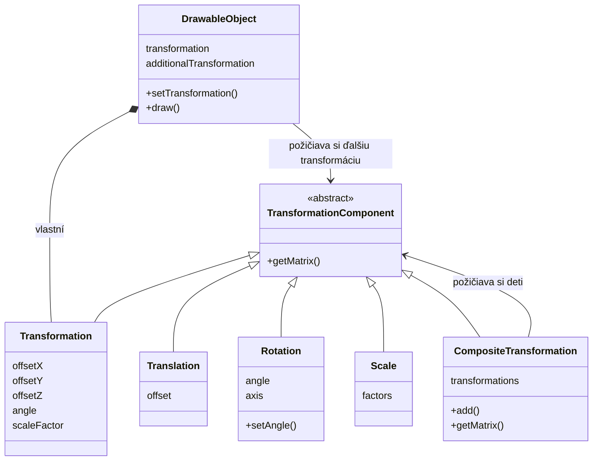

# Úloha 4 - Modelové matice, Kompozit a slnečná sústava

Autor projektu: Martin Jarabica, jar0193  
Obdobie: od commitu `35d2347` zo 7. 10. 2026 po pracovnú verziu z 9. 10. 2026.  
Podklady: aktuálny zdrojový kód, zmeny oproti HEAD, zadania LMS/Kelvin a konzultácie.  
Poznámky pripravené s pomocou AI; ide o review a dokumentáciu, nie o úpravu implementácie.

## 1. Týždenný prehľad

Cieľom je nahradiť transformačné rovnice modelovou maticou 4 × 4 a umožniť objektom používať jednotlivé aj zložené transformácie. Na skladanie používame návrhový vzor Kompozit, overujeme vplyv poradia násobenia a rozširujeme les o náhodné rozloženie. V novej slnečnej sústave kombinujeme obiehanie, vlastnú rotáciu a mierku Slnka, Zeme a Mesiaca; funkcie sú implementované, ale podklady odovzdania ešte nie sú dokončené.

## 2. Čo sme spravili

- Pridali sme tretie preťaženie `ShaderProgram::setUniform()` pre `glm::mat4`.
- Nahradili sme uniformy `offset`, `angle` a `scaleFactor` vo vykresľovacom vertex shaderi jedným `modelMatrix`.
- Do `Transformation` sme pridali `getMatrix()`, ktoré vytvára maticu z hodnôt ovládaných klávesnicou.
- Zaviedli sme spoločné rozhranie `TransformationComponent` a triedy `Translation`, `Rotation`, `Scale` a `CompositeTransformation`.
- Vysvetlili sme si Kompozit na samostatnom malom príklade; jeho spustenie bolo potvrdené v konzultácii, ale samostatný testovací projekt nie je uložený v tomto repozitári.
- Pridali sme `DrawableObject::setTransformation()` na priradenie ďalšej transformácie alebo kompozitu.
- Zachovali sme pôvodné klávesové ovládanie a kombinujeme ho s priradenou transformáciou.
- Na trojuholníku sme vyskúšali poradie posunu a rotácie; aktuálne používa kombináciu `R * T * S` a automaticky sa animuje.
- Pravidelné rozmiestnenie lesa sme nahradili náhodným posunom, mierkou a rotáciou. Zostalo 12 stromov, 12 kríkov, slnko a podpis.
- Rozšírili sme `Model` o podporu šiestich alebo deviatich hodnôt na vrchol.
- Pridali sme učiteľove farebné modely `sun.h`, `earth.h` a `moon.h`.
- Vytvorili sme piatu scénu a hierarchicky zložili obežné dráhy Zeme a Mesiaca.
- Pridali sme vlastnú rotáciu Zeme, Mesiaca aj Slnka.
- Vyskúšali sme rôzne osi a podľa požadovaného vzhľadu vrátili obežné dráhy do roviny obrazovky.
- Po opravách solárnej scény sme úspešne zostavili Debug x64. Pri zostavení zostáva linkerové upozornenie `LNK4098`.

## 3. Ako sme to spravili (Ukážky kódu & Vysvetlenie)

### Jedna matica namiesto samostatných rovníc

Pôvodný vertex shader mal:

```glsl
gl_Position =
    vec4(rotatedPosition * scaleFactor + offset, 1.0);
```

Aktuálny shader používa:

```glsl
uniform mat4 modelMatrix;

void main()
{
    vertexColor = abs(color);
    gl_Position = modelMatrix * vec4(position, 1.0);
}
```

Matica obsahuje kombináciu posunu, rotácie a mierky. Shader ju použije pre každý vrchol, takže údaje modelu vo VBO nemusíme pri animácii prepisovať.

`vec4(position, 1.0)` vytvára homogénne súradnice bodu. Štvrtá zložka umožňuje zapísať aj posun ako násobenie maticou; smerový vektor by pri čisto afinných transformáciách používal `w = 0`, aby ho posun neovplyvnil.

Použitie matice 4 × 4 samo osebe nevytvorí perspektívu. Aktuálny shader zapisuje priamo do clip space a používané afinné matice zachovávajú `w = 1`; view a projekčnú maticu zatiaľ nemáme. Kamera a perspektívne premietanie sú uvedené ako látka pre ďalšie cvičenie.

### Poslanie matice cez uniform

Deklarácia nového preťaženia:

```cpp
void setUniform(
    const char* name, const glm::mat4& matrix) const;
```

Jadro implementácie v `ShaderProgram.cpp`:

```cpp
GLint location = glGetUniformLocation(programID, name);

if (location == -1)
{
    std::cerr << "Uniform not found: " << name << '\n';
    std::exit(EXIT_FAILURE);
}

use();
glUniformMatrix4fv(
    location, 1, GL_FALSE, glm::value_ptr(matrix));
```

Ide o skrátenú ukážku s upraveným textom hlásenia; v aktuálnom zdrojovom súbore je ešte preklep `Uniform not foundL:`.

`1` znamená jednu maticu, `GL_FALSE` znamená bez transpozície a `glm::value_ptr()` poskytne ukazovateľ na jej hodnoty. Pred odoslaním vyberieme shader program. Všetky tri preťaženia `setUniform()` zostali v triede, hoci súčasné kreslenie objektov používa maticovú verziu.

### Základná Transformation používa GLM

Skrátená, významovo zhodná verzia `Transformation::getMatrix()`:

```cpp
glm::mat4 matrix(1.0f);
matrix = glm::translate(
    matrix, glm::vec3(offsetX, offsetY, offsetZ));
matrix = glm::rotate(
    matrix, angle, glm::vec3(0.0f, 1.0f, 0.0f));
matrix = glm::scale(matrix, glm::vec3(scaleFactor));
return matrix;
```

`glm::mat4(1.0f)` je jednotková matica, ktorá bod nemení. Tieto volania vytvoria `T * R * S`; pri násobení stĺpcovým vektorom sa na vrchol najprv uplatní S, potom R a nakoniec T.

Trieda tak zachovala hodnoty a ovládanie z úlohy 3, ale namiesto odosielania troch samostatných uniformov poskytuje jednu maticu.

### Rozhranie a listy Kompozitu

```cpp
class TransformationComponent
{
public:
    virtual ~TransformationComponent() = default;
    virtual glm::mat4 getMatrix() const = 0;
};
```

Spoločné rozhranie umožňuje pýtať si maticu bez toho, aby volajúci musel vedieť, či ide o jednu rotáciu alebo celú skupinu transformácií.

`Translation` vytvára maticu cez `glm::translate()`, `Scale` cez `glm::scale()` a `Rotation` cez `glm::rotate()`. Rotácia navyše umožňuje meniť uhol:

```cpp
void Rotation::setAngle(float angleInRadians)
{
    angle = angleInRadians;
}

glm::mat4 Rotation::getMatrix() const
{
    glm::mat4 matrix(1.0f);
    matrix = glm::rotate(matrix, angle, axis);
    return matrix;
}
```

Samostatné názvy `Translation`, `Rotation` a `Scale` sú naše implementačné rozhodnutie. Kelvin požaduje Kompozit; netvrdíme, že učiteľ predpísal presne tieto názvy alebo že iba takto možno riešenie vytvoriť.

### Skupina transformácií

```cpp
void CompositeTransformation::add(
    TransformationComponent& transformation)
{
    transformations.push_back(&transformation);
}

glm::mat4 CompositeTransformation::getMatrix() const
{
    glm::mat4 matrix(1.0f);

    for (const TransformationComponent* transformation
         : transformations)
    {
        matrix = matrix * transformation->getMatrix();
    }

    return matrix;
}
```

Kompozit má rovnaké rozhranie ako jednotlivá transformácia. Uchováva odkazy na deti a násobí ich matice v poradí pridania. Dieťa môže byť ďalší kompozit, takže vzniká hierarchia.

Pri pridaní T, R, S je výsledok `T * R * S`. Poradie uložených matíc však nie je poradie účinkov na vrchol: ten sa spracúva sprava doľava.

Schematický diagram vzťahov používaných pri transformáciách:



Tento diagram je súčasť poznámok. Samostatný pôvodný `CLASS_DIAGRAM.md` v koreňovom priečinku zostáva diagramom úlohy 3.

### Priradenie transformácie objektu

Aktuálne riešenie v `DrawableObject.cpp`:

```cpp
void DrawableObject::setTransformation(
    const TransformationComponent& newTransformation)
{
    additionalTransformation = &newTransformation;
}

void DrawableObject::draw() const
{
    glm::mat4 modelMatrix = transformation.getMatrix();

    if (additionalTransformation != nullptr)
    {
        modelMatrix =
            modelMatrix * additionalTransformation->getMatrix();
    }

    shaderProgram.use();
    shaderProgram.setUniform("modelMatrix", modelMatrix);
    model.draw();
}
```

Objekt naďalej vlastní základnú transformáciu ovládanú klávesnicou. Ďalšiu transformáciu si požičiava cez ukazovateľ. Pri kreslení obe spojí.

`setTransformation()` neuloží jednu nemennú kópiu matice. Uchová adresu transformácie a pri každom snímku si z nej vypýta aktuálnu maticu. Preto sa zmena uhla cez `setAngle()` okamžite prejaví pri ďalšom kreslení.

### Test poradia na trojuholníku

Používame posun `(0.4, 0, 0)`, rotáciu približne 45° okolo Z a mierku `0.6`.

Variant A:

```cpp
triangleMovement.add(triangleTranslation);
triangleMovement.add(triangleRotation);
```

Výsledok po pridaní mierky je `T * R * S`: najprv zmenšenie, potom otočenie okolo lokálneho počiatku a nakoniec posun doprava.

Variant B, ktorý je teraz v aplikácii:

```cpp
triangleMovement.add(triangleRotation);
triangleMovement.add(triangleTranslation);
```

Výsledok je `R * T * S`: po zmenšení sa objekt posunie a potom sa otočí aj jeho posunutá poloha. Lokálny počiatok modelu sa pri uvedenom uhle premiestni z `(0.4, 0, 0)` približne na `(0.283, 0.283, 0)`.

Pri animácii variantu B trojuholník obieha okolo počiatku scény. Násobenie matíc vo všeobecnosti nie je komutatívne, preto `T * R` a `R * T` dávajú iný výsledok.

Test sme počas vývoja vyskúšali, ale dvojica finálnych screenshotov tejto úlohy ešte nie je doložená v repozitári. Pri porovnávaní treba ponechať rovnaký uhol a dočasne zastaviť jeho automatické zväčšovanie; v kontrolovanej aktuálnej verzii zväčšovanie ešte beží.

### Náhodný les

Namiesto riadkov a stĺpcov teraz vytvárame náhodné hodnoty:

```cpp
std::mt19937 forestGenerator(std::random_device{}());

std::uniform_real_distribution<float> forestX(-0.75f, 0.75f);
std::uniform_real_distribution<float> forestY(-0.80f, 0.20f);
std::uniform_real_distribution<float> forestAngle(0.0f, 6.283185f);
std::uniform_real_distribution<float> treeScaleRange(0.04f, 0.06f);
std::uniform_real_distribution<float> bushScaleRange(0.15f, 0.25f);

t.offsetX = forestX(forestGenerator);
t.offsetY = forestY(forestGenerator);
t.scaleFactor = treeScaleRange(forestGenerator);
t.angle = forestAngle(forestGenerator);
```

Kríky používajú vlastný rozsah mierky. Náhodné hodnoty nastavujeme pri vytváraní objektov pred slučkou, takže les neskáče na nové miesta pri každom snímku. Znovu sa vygeneruje pri ďalšom spustení aplikácie.

Aj bez samostatného kompozitu pre každý strom používa les triedu `Transformation`, ktorej matica už skladá posun, rotáciu a mierku.

### Modely so šiestimi alebo deviatimi hodnotami na vrchol

Pôvodná verzia `Model` predpokladala vždy šesť hodnôt. Nové modely planét obsahujú deväť:

| Formát | Údaje | Krok medzi vrcholmi |
|---|---|---|
| 6 hodnôt | XYZ + RGB alebo XYZ + normála | `6 * sizeof(float)` |
| 9 hodnôt | XYZ + RGB + normála | `9 * sizeof(float)` |

V deklarácii konštruktora je predvolená hodnota 6, takže staršie volania netreba meniť. Nové modely dostávajú tretí argument 9.

Podstatná zmena:

```diff
- vertexCount * 6 * sizeof(float)
+ vertexCount * valuesPerVertex * sizeof(float)

- 6 * sizeof(float)
+ stride
```

V aktuálnej implementácii sa veľkosť bufferu počíta s prevodom počtu vrcholov na `GLsizeiptr`; `stride` sa vypočíta z `valuesPerVertex * sizeof(float)`.

Pre deväť hodnôt pridávame samostatnú normálu:

```cpp
if (valuesPerVertex == 9)
{
    glEnableVertexAttribArray(2);
    glVertexAttribPointer(
        2, 3, GL_FLOAT, GL_FALSE, stride,
        (void*)(6 * sizeof(float)));
}
```

Atribút 0 je poloha, 1 je farba a 2 je normála. Učiteľove modely nemeníme; upravili sme ich interpretáciu v našom kóde. Každý z troch planetárnych modelov má podľa dodaných hlavičiek 11 520 vrcholov, teda 3 840 trojuholníkov.

### Slnečná sústava a oddelené transformácie

Zem má zvlášť obežnú dráhu, vlastnú rotáciu a mierku:

```cpp
Translation earthDistance(0.55f, 0.0f, 0.0f);
Rotation earthOrbitRotation(0.0f, 0.0f, 0.0f, 1.0f);

CompositeTransformation earthOrbit;
earthOrbit.add(earthOrbitRotation);
earthOrbit.add(earthDistance);

Rotation earthSpin(0.0f, 1.0f, 0.0f, 0.0f);
Scale earthScale(0.10f, 0.10f, 0.10f);

CompositeTransformation earthTransformation;
earthTransformation.add(solarSunObject.getTransformation());
earthTransformation.add(earthOrbit);
earthTransformation.add(earthSpin);
earthTransformation.add(earthScale);

earthObject.setTransformation(earthTransformation);
```

Mesiac preberá obežnú dráhu Zeme, ale nepreberá jej vlastnú rotáciu ani mierku:

```cpp
CompositeTransformation moonTransformation;
moonTransformation.add(solarSunObject.getTransformation());
moonTransformation.add(earthOrbit);
moonTransformation.add(moonOrbit);
moonTransformation.add(moonSpin);
moonTransformation.add(moonScale);

moonObject.setTransformation(moonTransformation);
```

`moonOrbit` podobne obsahuje rotáciu a posun, tentoraz vo vzdialenosti `0.20` od Zeme. Mierka Mesiaca je `0.045`.

Ak spoločnú transformáciu ovládanú klávesnicou označíme G, výsledné zloženie je:

```text
Slnko: G * vlastná rotácia Slnka * mierka Slnka
Zem:   G * obeh Zeme * posun Zeme * vlastná rotácia Zeme * mierka Zeme
Mesiac:G * obeh Zeme * posun Zeme * obeh Mesiaca * posun Mesiaca
          * vlastná rotácia Mesiaca * mierka Mesiaca
```

Preberáme `solarSunObject.getTransformation()`, teda základnú transformáciu G. Nepreberáme celý kompozit Slnka s jeho mierkou a vlastnou rotáciou. Tým zabránime tomu, aby zmenšenie Slnka skrátilo aj obežné dráhy alebo jeho vlastná rotácia poháňala všetky planéty.

Keď je v scéne 5 ovládaným objektom Slnko, klávesnica mení spoločnú transformáciu sústavy. Podpis je samostatný objekt a tento spoločný pohyb nepreberá.

### Dynamická animácia a voľba osí

Aktuálne rýchlosti obežných dráh:

```cpp
earthOrbitAngle += 0.2f * deltaTime;
moonOrbitAngle += 1.2f * deltaTime;
earthOrbitRotation.setAngle(earthOrbitAngle);
moonOrbitRotation.setAngle(moonOrbitAngle);

solarSunSpinAngle += 0.4f * deltaTime;
solarSunSpin.setAngle(solarSunSpinAngle);
```

| Pohyb | Os | Rýchlosť v radiánoch za sekundu |
|---|---|---|
| Zem obieha Slnko | Z | 0.2 |
| Mesiac obieha Zem vo svojom nadradenom rámci | Z | 1.2 |
| Vlastná rotácia Zeme | X | 0.8 |
| Vlastná rotácia Mesiaca | X | 0.6 |
| Vlastná rotácia Slnka | Y | 0.4 |

Mesiac navyše preberá rotáciu obežného rámca Zeme; uvedená rýchlosť 1.2 je rýchlosť jeho vlastného kompozitu `moonOrbit`.

Rotácia okolo Z prebieha v rovine XY, preto dráhy vidíme ako kružnice v rovine obrazovky pri základnom nastavení sústavy. Pri skúške osi Y prebiehalo obiehanie v rovine XZ a bez naklonenia pohľadu vyzeralo ako pohyb zľava doprava s meniacou sa hĺbkou. Vrátili sme dráhy na Z, ponechali vlastné rotácie planét na X a doplnili vlastnú rotáciu Slnka na Y.

### Čo sa vykoná v jednom snímku

1. Zmeriame `deltaTime` a aktualizujeme uhly.
2. Vyberieme aktívnu scénu a spracujeme klávesové ovládanie.
3. Vyčistíme farebný aj hĺbkový buffer.
4. Scéna zavolá `DrawableObject::draw()` pre svoje objekty.
5. Objekt vypočíta výslednú maticu a pošle ju do shaderu.
6. `Model::draw()` pripojí VAO a zavolá `glDrawArrays()`.
7. Vertex shader prepočíta polohy; OpenGL zostaví a rasterizuje trojuholníky.
8. Fragment shader nastaví farbu a test hĺbky rieši zakrývanie povrchov.
9. Výmenou bufferov zobrazíme snímok a spracujeme udalosti.

Geometria zostáva vo VBO rovnaká. `GL_STATIC_DRAW` je preto primerané aj pri týchto animovaných objektoch: mení sa matica, nie nahrané vrcholy.

## 4. Code Review & Poznatky

- **Kompozit má spoločné rozhranie pre list aj skupinu.** Na to potrebujeme virtuálne `getMatrix()`; názvy konkrétnych tried sú náš návrh.
- **Poradie transformácií má viditeľný význam.** Pri `R * T` sa otáča aj posunutá poloha. Pri `T * R` sa otočený model až následne premiestni.
- **Stred otáčania závisí od počiatku modelu.** Vlastná rotácia sa deje okolo lokálneho počiatku. Pri modeli, ktorý nie je vhodne centrovaný, nemusí ísť o jeho geometrický stred.
- **Životnosť vypožičaných transformácií je nutná podmienka.** `CompositeTransformation` deti nevlastní a `DrawableObject` nevlastní priradený kompozit. Naše transformácie sú lokálne premenné existujúce počas celej slučky; odkaz na dočasný alebo už zaniknutý objekt by bol chybný.
- **Ovládanie a dodatočný kompozit sú dve vrstvy.** Základný stav objektu zostal zachovaný kvôli klávesnici. Ďalší kompozit sa násobí za ním, takže zmena základného stavu ovplyvní aj celý priradený pohyb.
- **Mesiac musí zdieľať polohu Zeme, nie jej veľkosť.** Oddelený `earthOrbit` zabraňuje nechcenému zmenšeniu dráhy Mesiaca alebo preberaniu vlastného pretáčania povrchu Zeme.
- **Parameter formátu musí ovplyvniť všetky potrebné miesta.** Nestačilo doplniť tretí parameter konštruktora `Model`, keď veľkosť bufferu a stride stále používali pevnú šestku. Opravili sme obe miesta a pridali tretí atribút.
- **Deštruktor Model zostal zachovaný.** Stále uvoľňuje VAO a VBO; rozšírenie formátu túto zodpovednosť nemení.
- **Referencie sa inicializujú pri vytváraní objektu.** Inicializačný zoznam v konštruktore `DrawableObject` je potrebný pre jeho referenčné členy. Číselné členy v jednoduchších triedach sme podľa preferencie priraďovali v tele konštruktora.
- **Planéty majú farby vrcholov, nie hotový systém textúr alebo osvetlenia.** Atribút normály síce nahrávame, ale súčasný shader ho nepoužíva na svetelné výpočty.
- **Úspešný build nie je overenie všetkých obrazov.** Predchádzajúce zostavenie Debug x64 po doplnení rotácie Slnka prešlo; počas tejto tvorby poznámok sa robilo iba čítanie a dokumentácia. Vzhľad kontroluje používateľ v spustenej aplikácii.
- **Zostáva upozornenie LNK4098.** Oznamuje konflikt použitých runtime knižníc. Nevyriešili sme ho automatickým potlačením; zostavenie napriek nemu vytvorilo spustiteľný súbor.
- **Drobné nedostatky sú v review pomenované, nie opravené.** Napríklad preklep `Uniform not foundL:`, nadbytočný bodkočiarkový znak v tejto vetve a staré zakomentované pravidelné rozloženie lesa zostali v implementácii.

### Stav pred odovzdaním

Funkčná implementácia požiadaviek Kelvin je prítomná: modelová matica, priradené a zložené transformácie, statické aj dynamické správanie, experiment s poradím, Kompozit, náhodný les a slnečná sústava.

Ešte treba dokončiť alebo doložiť:

- Dva porovnateľné screenshoty poradia transformácií a ich vysvetlenie v súhrne.
- Praktické overenie všetkých osí a skladania transformácií na vlastnom loginovom modeli podľa LMS.
- Aktualizovaný samostatný triedny diagram; pôvodný diagram zatiaľ opisuje úlohu 3.
- Hlavičky s autorom a loginom a označenie pomoci AI v príslušných vlastných zdrojoch.
- Screenshoty aktuálnej úlohy a konečný súhrn odovzdania.
- Poslednú kontrolu po vlastných ďalších úpravách a commit/push nových zdrojov.

V čase review sú `Rotation`, `Scale`, `CompositeTransformation` a modely planét medzi novými necommitnutými súbormi. Commit `35d2347` zachytáva skorší prechod na matice a začiatok rozhrania transformácií; úplná aktuálna implementácia ešte nie je obsiahnutá v tomto commite.
